# Biblion

Biblion is a word-puzzle game made with the **Godot Engine**, developed as the final project of the **Human-Computer Interaction (IG05)** course at **Télécom Paris**. It keeps the intuitive color-feedback mechanic of the famous [*Wordle*](https://www.nytimes.com/games/wordle/index.html), but replaces the once-a-day format with an endless, level-based run featuring a score system, coins, a shop and combinable power-ups.

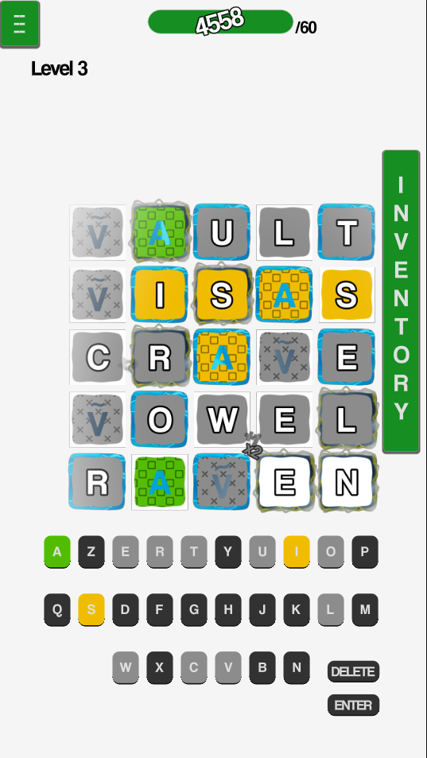

> ⚠️ **Status:** academic prototype. The game is not fully finished and may be unstable at higher levels (see [Known limitations](#-known-limitations)).

---

## Authors

- Alex Onceanu
- Francisco de Castro Leal Henriques
- Mathieu Senart
- Pedro Nascimento Coêlho

---


## Table of Contents

- [Running the game](#running-the-game)
- [How to play](#how-to-play)
  - [Power-ups](#power-ups)
  - [Progression loop](#progression-loop)
- [Features](#features)
- [Known limitations](#known-limitations)
- [Report](#report)
- [Credits and license](#credits-and-license)
- [Screenshots](#screenshots)

---

## Running the game

The game is a **Godot** project.

1. Install [Godot Engine](https://godotengine.org/download) (version 4.6.1 or higher).
2. Clone the repository:
   ```bash
   git clone https://github.com/PedroNCPro/Biblion-Game.git
   ```
3. Open Godot, click **Import**, and select the `Godot_files/project.godot` file.
4. Press **F5** to run the game, or use **Project → Export** to build an executable or mobile package.

> 📱 The game was originally designed for mobile, but it can also work for desktop devices. If you test it in the editor with a mouse, remember that touch targets are sized for fingers.

---

## How to play

1. Start a run from the main menu. A run is made of several levels.
2. Each level generates a **grid with a custom, irregular shape**. The **last row** defines the length of the secret word.
3. The game picks a hidden word from the dictionary matching that length (3 to 6 letters depending on the grid shape).
4. Type your guess using the on-screen keyboard or your physical keyboard. The grid is filled **one row at a time (top-down) and one cell at a time (left-right)**.
5. When a row is complete, each letter is evaluated:

| Color | Meaning | Points |
|---|---|---|
| 🟩 Green | Correct letter, correct position | **+10** |
| 🟨 Yellow | Letter is in the word, wrong position | **+5** |
| ⬜ Grey | Letter is not in the word | **+1** |

6. Points are then modified by **power-ups** (see below).
7. Reach the level's **score target** before running out of attempts to win. The definition of the secret word is displayed on the results screen, even if you didn't find it.

> 💡 The level does not stop when you find the word: extra rows give you room to farm points and set up combos.

### Power-ups

Power-ups are attached to letters and are built from the combination of three sub-types, each with its own visual language so the player can read what a letter does at a glance:

| Sub-type | Role | Visual representation |
|---|---|---|
| **Element** (fire, water, earth, air) | Triggers elemental reactions | Texture on the letter |
| **Point modification** | Adds, multiplies or repeats a bonus (diacritic) | Diacritic on the letter |
| **Area of effect** | Affects rows, columns, crosses or neighbouring cells | Background texture of the cell |

Effects can chain: when a power-up activates another one, the new effect is queued and resolved before the game moves on to the next letter. Infinite loops are possible (a letter that reactivates another that reactivates the first), but the game guarantees they will not freeze it.

### Progression loop

```
play a level → earn points → earn coins → buy power-ups in the shop → next, harder level
```

After each level you receive coins (including bonuses for milestones). In the **shop**, a small random selection of unique power-ups is offered. Tap an icon to see its description and buy it.

---

## Features

- Infinite level generation with randomized, non-uniform grids
- Results screen with the definition of the secret word
- Power-up system combining element, point-modification and area-of-effect types
- Shop that generates random unique power-ups
- VFX that show how active power-ups affect the current guess
- Gesture controls to navigate the grid (pinch to zoom, drag to move)
- High-contrast UI option and a unified UI theme

---


## Known limitations

**Planned features not implemented:**
- Temporary and other power-up categories (only permanent power-ups exist)
- Visual indicator for the next cell to be filled
- Save system / "Continue" a run (started, but not finished)

**Other known issues:**
- Possible instability at higher levels
- Some visuals could be further polished
- The level doesn't end after the secret word is found (intentional, but players found it confusing)

**Ideas for future work:** improve usability on mobile, rebalance early levels, interactive tutorial, and complete the missing features.

---

## Report

For more detailed information about the project, see the project report: [`Project_Report`](Project_Report.pdf).

---

## Credits and license

- Word list and definitions come from the [Wordset dictionary](https://github.com/wordset/wordset-dictionary), licensed under [Creative Commons Attribution-ShareAlike 4.0 International](https://creativecommons.org/licenses/by-sa/4.0/).
- Inspired by [Wordle](https://www.nytimes.com/games/wordle/index.html) (The New York Times) and by roguelikes such as [*Balatro*](https://www.playbalatro.com/).
- The original development repository is available at [Alex-Onceanu/IGRWordle](https://github.com/Alex-Onceanu/IGRWordle).


## Screenshots

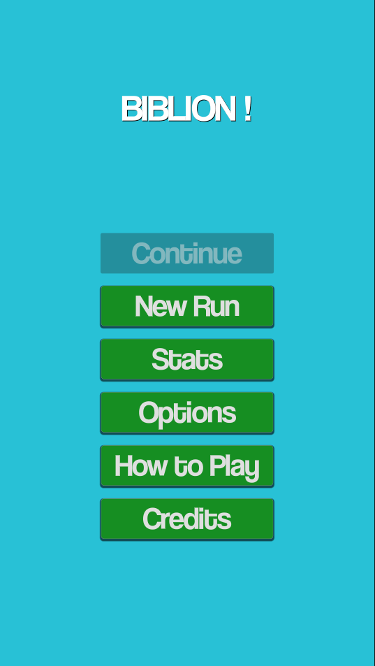
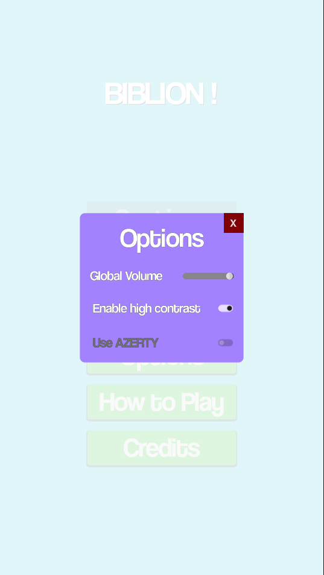
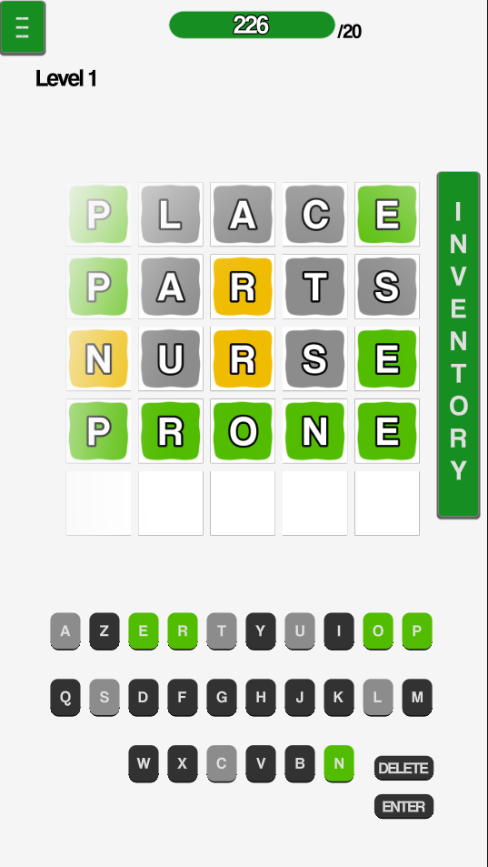
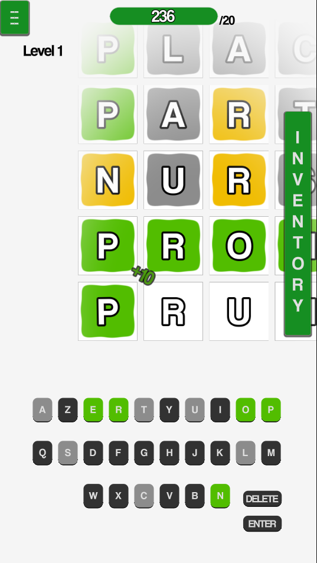
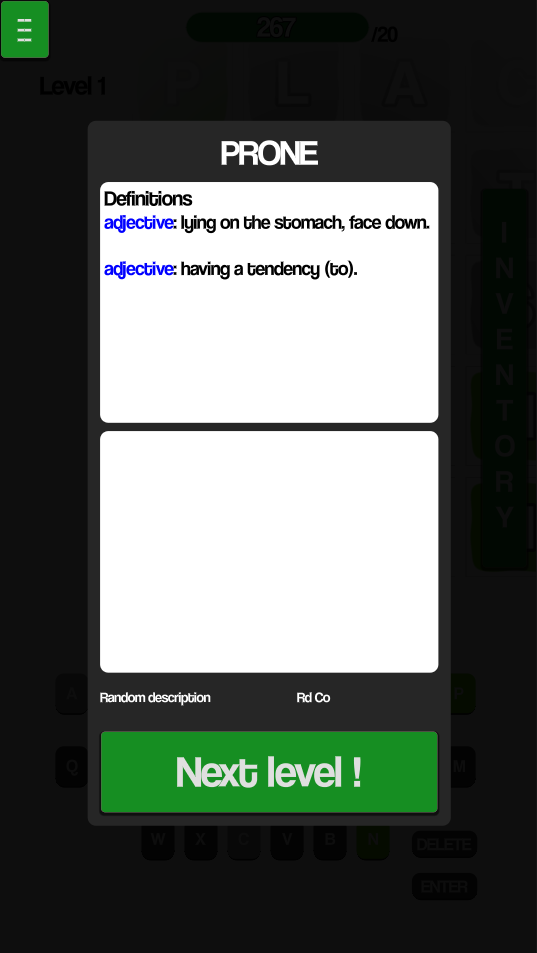
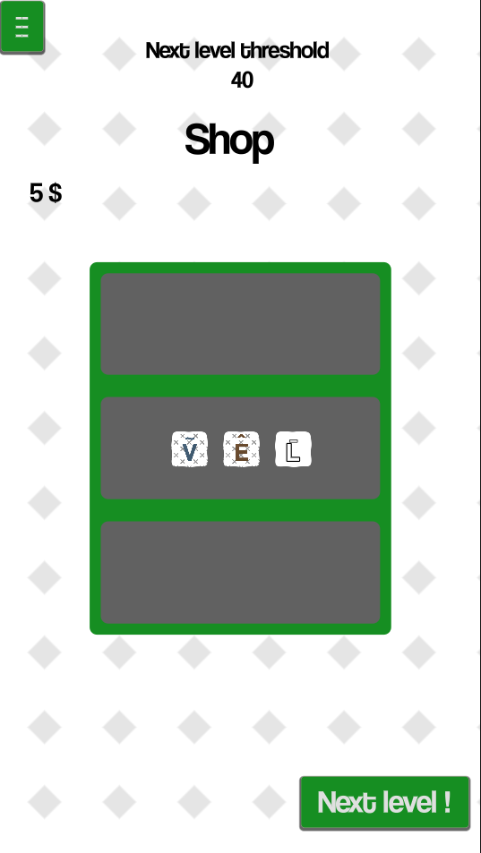
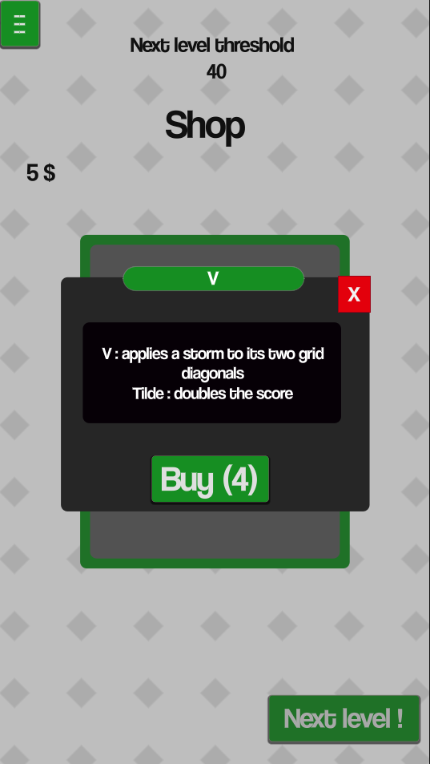
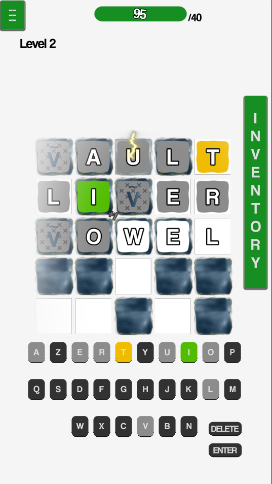
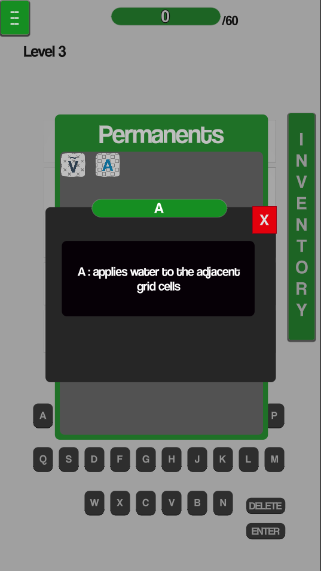
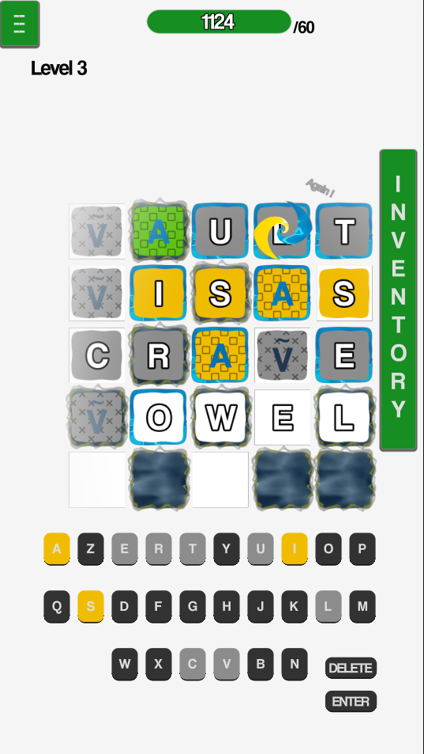
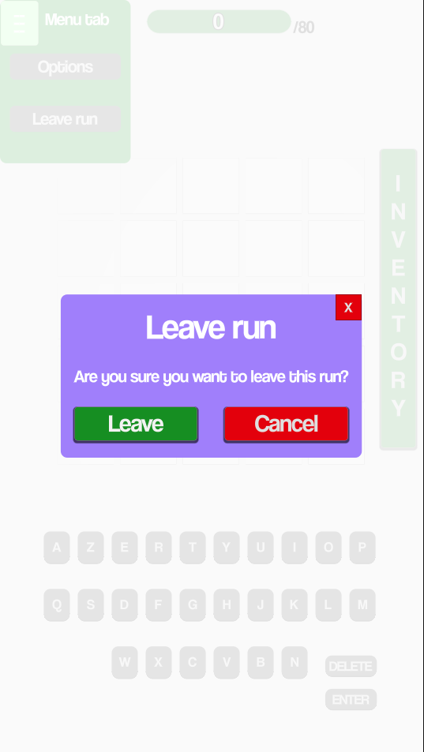
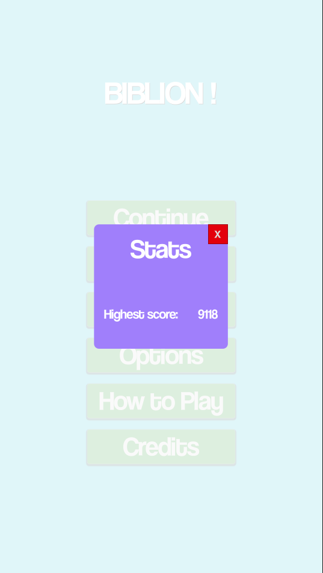